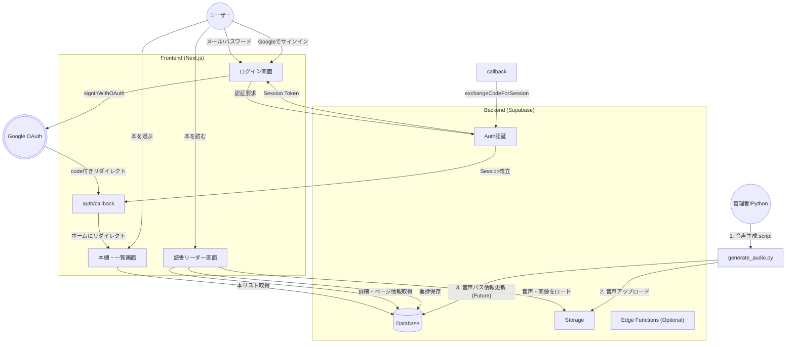

```mermaid
flowchart TD
    User((ユーザー))
    Admin(("管理者/Python"))
    Google((("Google OAuth")))

    subgraph Frontend ["Frontend (Next.js)"]
        LoginUI[ログイン画面]
        LibraryUI[本棚・一覧画面]
        ReaderUI[読書リーダー画面]
        Callback[auth/callback]
    end

    subgraph Backend ["Backend (Supabase)"]
        Auth[Auth認証]
        DB[(Database)]
        Storage[Storage]
        EdgeFunc["Edge Functions (Optional)"]
    end

    User -->|メール/パスワード| LoginUI
    LoginUI -->|認証要求| Auth
    Auth -->|Session Token| LoginUI

    User -->|Googleでサインイン| LoginUI
    LoginUI -->|signInWithOAuth| Google
    Google -->|code付きリダイレクト| Callback
    callback -->|exchangeCodeForSession| Auth
    Auth -->|Session確立| Callback
    Callback -->|ホームにリダイレクト| LibraryUI

    
    User -->|本を選ぶ| LibraryUI
    LibraryUI -->|本リスト取得| DB
    
    User -->|本を読む| ReaderUI
    ReaderUI -->|詳細・ページ情報取得| DB
    ReaderUI -->|進捗保存| DB
    
    ReaderUI -->|音声・画像をロード| Storage
    
    Admin -->|1. 音声生成 script| PythonScript[generate_audio.py]
    PythonScript -->|2. 音声アップロード| Storage
    PythonScript -->|"3. 音声パス情報更新 (Future)"| DB
```
