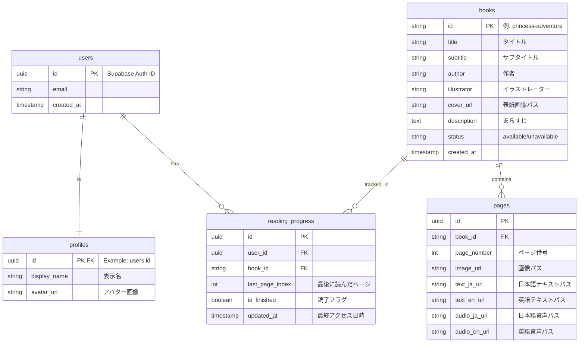

```mermaid
erDiagram
    users ||--|| profiles : "is"
    users ||--o{ reading_progress : "has"
    books ||--o{ pages : "contains"
    books ||--o{ reading_progress : "tracked_in"

    users {
        uuid id PK "Supabase Auth ID"
        string email
        timestamp created_at
    }

    profiles {
        uuid id PK, FK "Example: users.id"
        string display_name "表示名"
        string avatar_url "アバター画像"
    }

    books {
        string id PK "例: princess-adventure"
        string title "タイトル"
        string subtitle "サブタイトル"
        string author "作者"
        string illustrator "イラストレーター"
        string cover_url "表紙画像パス"
        text description "あらすじ"
        string status "available/unavailable"
        timestamp created_at
    }

    pages {
        uuid id PK
        string book_id FK
        int page_number "ページ番号"
        string image_url "画像パス"
        string text_ja_url "日本語テキストパス"
        string text_en_url "英語テキストパス"
        string audio_ja_url "日本語音声パス"
        string audio_en_url "英語音声パス"
    }

    reading_progress {
        uuid id PK
        uuid user_id FK
        string book_id FK
        int last_page_index "最後に読んだページ"
        boolean is_finished "読了フラグ"
        timestamp updated_at "最終アクセス日時"
    }
```
