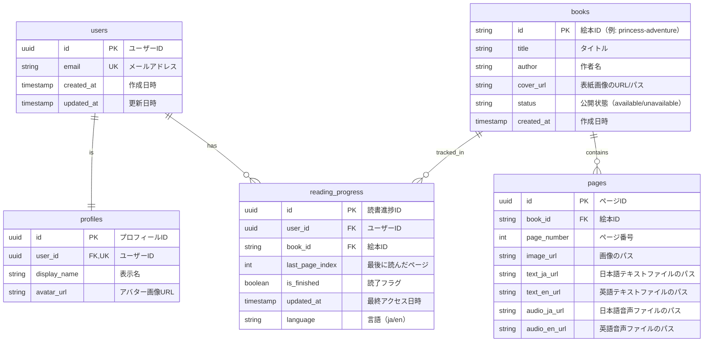

```mermaid
erDiagram
    users ||--|| profiles : "is"
    users ||--o{ reading_progress : "has"
    books ||--o{ pages : "contains"
    books ||--o{ reading_progress : "tracked_in"

    users {
        uuid id PK "ユーザーID"
        string email UK "メールアドレス"
        timestamp created_at "作成日時"
        timestamp updated_at "更新日時"
    }

    profiles {
        uuid id PK "プロフィールID"
        uuid user_id FK, UK "ユーザーID"
        string display_name "表示名"
        string avatar_url "アバター画像URL"
    }

    books {
        string id PK "絵本ID（例: princess-adventure）"
        string title "タイトル"
        string author "作者名"
        string cover_url "表紙画像のURL/パス"
        string status "公開状態（available/unavailable）"
        timestamp created_at "作成日時"
    }

    pages {
        uuid id PK "ページID"
        string book_id FK "絵本ID"
        int page_number "ページ番号"
        string image_url "画像のパス"
        string text_ja_url "日本語テキストファイルのパス"
        string text_en_url "英語テキストファイルのパス"
        string audio_ja_url "日本語音声ファイルのパス"
        string audio_en_url "英語音声ファイルのパス"
    }

    reading_progress {
        uuid id PK "読書進捗ID"
        uuid user_id FK "ユーザーID"
        string book_id FK "絵本ID"
        int last_page_index "最後に読んだページ"
        boolean is_finished "読了フラグ"
        timestamp updated_at "最終アクセス日時"
        string language "言語（ja/en）"
    }
```
