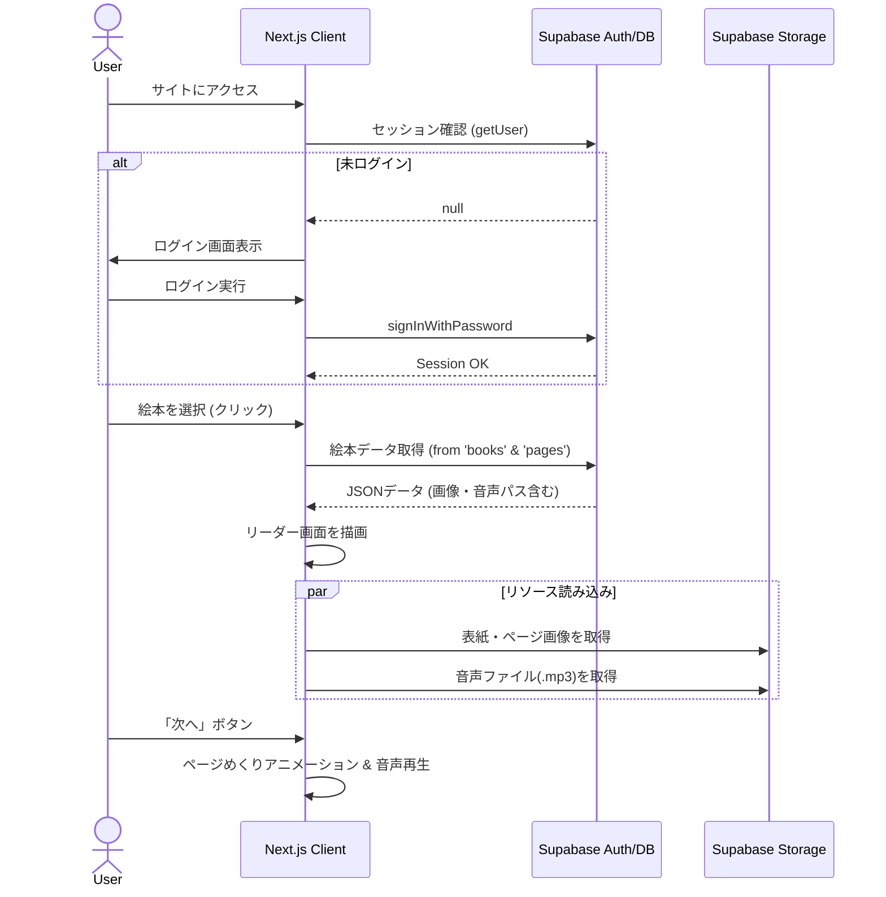

```mermaid
sequenceDiagram
    actor User
    participant NextJS as Next.js Client
    participant Supabase as Supabase Auth/DB
    participant Storage as Supabase Storage

    User->>NextJS: サイトにアクセス
    NextJS->>Supabase: セッション確認 (getUser)
    
    alt 未ログイン
        Supabase-->>NextJS: null
        NextJS->>User: ログイン画面表示
        User->>NextJS: ログイン実行
        NextJS->>Supabase: signInWithPassword
        Supabase-->>NextJS: Session OK
    end

    User->>NextJS: 絵本を選択 (クリック)
    NextJS->>Supabase: 絵本データ取得 (from 'books' & 'pages')
    Supabase-->>NextJS: JSONデータ (画像・音声パス含む)
    
    NextJS->>NextJS: リーダー画面を描画
    
    par リソース読み込み
        NextJS->>Storage: 表紙・ページ画像を取得
        NextJS->>Storage: 音声ファイル(.mp3)を取得
    end

    User->>NextJS: 「次へ」ボタン
    NextJS->>NextJS: ページめくりアニメーション & 音声再生
```
