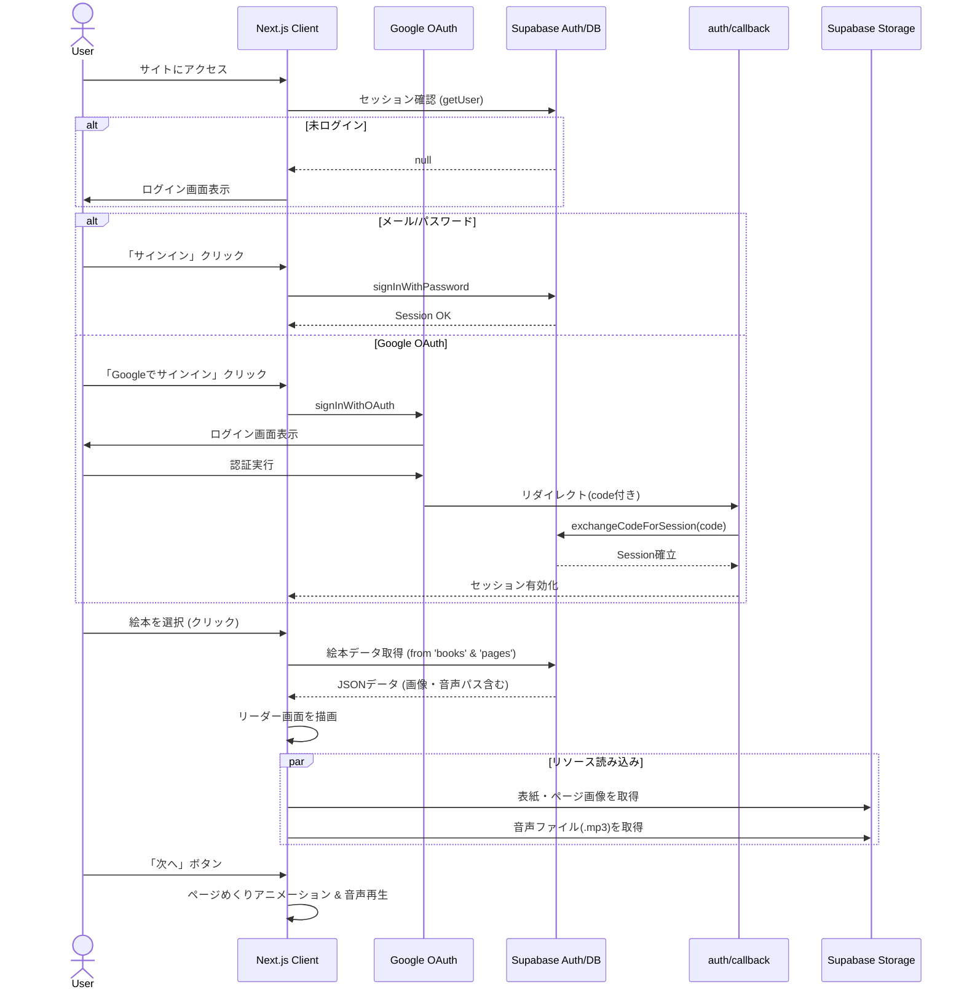

```mermaid
sequenceDiagram
    actor User
    participant NextJS as Next.js Client
    participant Google as Google OAuth
    participant Supabase as Supabase Auth/DB
    participant Callback as auth/callback
    participant Storage as Supabase Storage

    User->>NextJS: サイトにアクセス
    NextJS->>Supabase: セッション確認 (getUser)
    
    alt 未ログイン
        Supabase-->>NextJS: null
        NextJS->>User: ログイン画面表示
    end

    alt メール/パスワード
        User->>NextJS:「サインイン」クリック
        NextJS->>Supabase: signInWithPassword
        Supabase-->>NextJS: Session OK
    else Google OAuth
        User->>NextJS:「Googleでサインイン」クリック
        NextJS->>Google: signInWithOAuth
        Google->>User:ログイン画面表示
        User->>Google:認証実行
        Google->>Callback: リダイレクト(code付き)
        Callback->>Supabase: exchangeCodeForSession(code)
        Supabase-->>Callback: Session確立
        Callback-->>NextJS: セッション有効化
    end

    User->>NextJS: 絵本を選択 (クリック)
    NextJS->>Supabase: 絵本データ取得 (from 'books' & 'pages')
    Supabase-->>NextJS: JSONデータ (画像・音声パス含む)
    
    NextJS->>NextJS: リーダー画面を描画
    
    par リソース読み込み
        NextJS->>Storage: 表紙・ページ画像を取得
        NextJS->>Storage: 音声ファイル(.mp3)を取得
    end

    User->>NextJS: 「次へ」ボタン
    NextJS->>NextJS: ページめくりアニメーション & 音声再生
```
